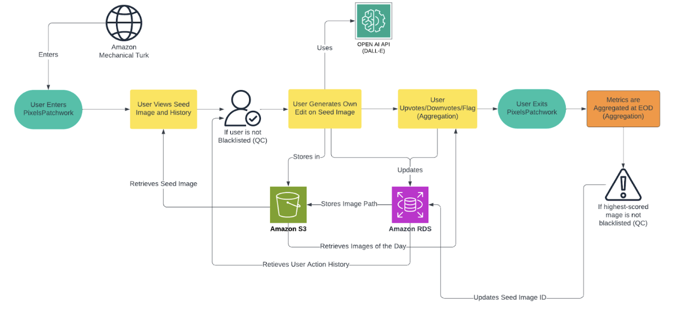

# PixelPatchwork

## Project Description

**PixelPatchwork** is a collaborative digital art platform that enables users to iteratively refine AI-generated images through masking, prompting, and a voting system to collectively curate high-quality images. The platform encourages collaboration by allowing participants to build on the work of others, fostering a sense of shared ownership and continuous improvement.

## Purpose

The purpose of this project is to:
- Investigate the limitations and possibilities of AI-generated art.
- Study worker skills in writing prompts that lead to high-quality images.
- Harness collaborative creativity through iterative and community-driven processes.

## Features

- **Image Generation**: Workers interact with a custom canvas to mask areas of an AI-generated image and provide prompts for modification.
- **Voting System**: Workers upvote or downvote images to surface the most creative or high-quality outputs.
- **Iterative Workflow**: The highest-voted image becomes the seed for the next day, creating a feedback loop to refine and build upon previous results.
- **Crowd Contributions**: Combines individual creativity with collective evaluation to produce diverse and evolving interpretations of seed images.

---

## Setup Instructions

### Prerequisites

- Python 3.9 or above
- Flask
- MySQL database credentials
- AWS S3 bucket for image storage
- OpenAI API key for DALL-E

### Installation Steps

1. Clone the repository:
   ```bash
   git clone <repository-url>
   cd PixelPatchwork
2. Create a python virtual environment:
    ```bash
    python3 -m venv venv
    source venv/bin/activate   # For Linux/MacOS
    venv\Scripts\activate      # For Windows
3. Install required packages:
    ```bash
    pip install -r requirements.txt
4. Configure .env with AWS, OpenAI, and MySQL credentials
5. Run the app:
    ```bash
    python3 src/app.py

## System Overview

1. **Frontend**: Built using HTML5, CSS, and JavaScript, with a custom canvas for user interaction.
    - **Landing Page**: Gives users detailed instructions to participate in the experiment.
    - **Image Generation Page**: Allows users to mask areas of the seed image and provide a prompt for targeted modifications.
    - **Voting Page**: Displays all submitted images for a day, enabling upvote/downvote functionality.

2. **Backend**: Flask application handles routing, image processing, and create/read/update operations.
    - Integrates with OpenAI's DALL-E API for image generation and storage.
    - Stores and handles logic for user contributions/metadata, voting data, and seed images in a MySQL database.

3. **Database**: MySQL database with three main tables:
    - **User**: Tracks user details.
    - **Image**: Stores image metadata, number of upvotes/downvotes, and prompts.
    - **Day**: Tracks daily seed images, winner of the day, and participation statistics.

4. **Quality Control**: 
    - **Voting Mechanism**: Users upvote or downvote images to collectively surface high-quality submissions. The voting stage allows us to evaluate the community's perception of quality.
    - **Prioritized Display**: Past winners are prominently displayed to inspire creativity, highlight exemplary work, and set benchmarks for future contributions.

5. **Aggregation**:
    - **Past Winners**: We aggregated a list of past winning images so users could see
    - **Comparison of Aggregated vs. Individual Responses**: We compared aggregated results with individual vote patterns to understand how collective feedback differed from personal preferences. This comparison highlighted the value of aggregation in surfacing the most broadly appreciated contributions.
    - **Vote Distribution**: We investigated the distribution of upvotes and downvotes across all images to identify patterns in user engagement

6. **Storage**: AWS S3 bucket for storing images. 

## Flow Diagram



## Future Work
- Expand the platform for multilingual support to engage a more diverse audience.
- Enhance scalability through database optimization and distributed architecture.
- Implement gamification elements to encourage higher engagement and quality submissions.